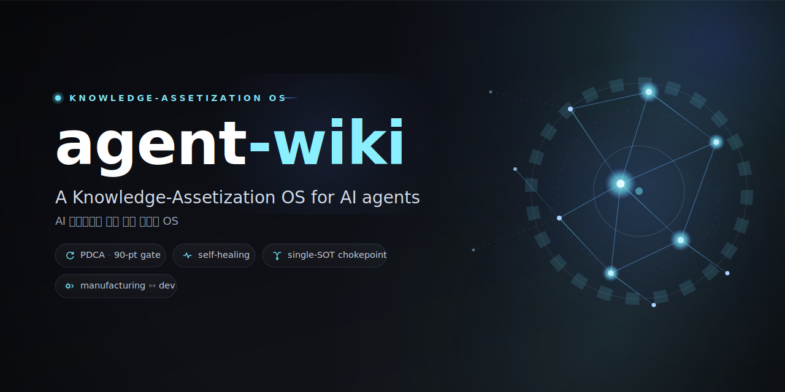

<p align="center">
  
</p>

<h1 align="center">agent-wiki</h1>

<p align="center">
  <b>A Knowledge-Assetization OS for AI agents</b><br>
  <sub>AI 에이전트를 위한 지식 자산화 OS · 산업 지식 + 비즈니스 로직 코어 에이전트 · 자가검증 · 크로스플랫폼</sub>
</p>

<p align="center">
  
  
  
  
</p>

> Turn scattered know-how into a **searchable, linked, verified, token-efficient** knowledge base that AI agents build on top of —
> where **manufacturing quality engineering meets agent harness engineering**, in one schema.
> It **lints itself**, **generates its own index**, and was hardened by an **adversarial 90-point self-healing loop**.

---

## TL;DR

**What** — A lean, scalable **template repo**: a per-project **core agent** (the business logic) sits on top of an **LLM wiki** (harness know-how · domain knowledge · personal ops), pulling knowledge *just-in-time*. Empty `example-*` notes are illustrative — fill them or scaffold a new project in seconds.

**Why it's different**
- 🏭↔🤖 **Manufacturing ↔ dev isomorphism** — PDCA, Andon, poka-yoke, TWI, FMEA, SPC, 5S mapped 1:1 to agent harness patterns. Not a metaphor; the same schema runs both a factory line and a software project.
- 🔒 **Dogfooded gate** — `gen-index` auto-generates every `INDEX.md` + machine map `llms.txt` (hand-edit = CI fail); `wiki-lint` enforces frontmatter, broken links, orphans, single-SOT, truncation budgets, freshness. `check-all` is the commit gate. The repo passes its own rules.
- ♻️ **Self-building** — produced by deep research → blueprint panel → fan-out authoring → an **adversarial 90-point review loop that self-heals until avg ≥90 ∧ P0/P1 = 0**.
- 🪙 **Token-efficient by design** — single-SOT chokepoints, JIT retrieval over preloading, fractal indexes, byte-aware truncation guards.
- 💻 **Cross-platform** — macOS / Linux / Windows (Git Bash · WSL). LF-enforced, locale-independent, CRLF-tolerant scripts.

**Quick start**
```bash
git clone <this-repo-url> && cd agent-wiki    # fork 했다면 본인 repo URL
# Windows: use Git Bash or WSL (scripts are POSIX bash; .gitattributes enforces LF)
bash scripts/install-hooks.sh                 # wire the commit gate (after git init/clone)
bash scripts/new-project.sh --agent-only myapp   # external-code project (brain + pointer)
bash scripts/new-project.sh --buildable  mytool  # from-scratch self-contained subtree
bash scripts/check-all.sh                     # regenerate indexes + run the gate
```

**Start reading** → [`AGENTS.md`](AGENTS.md) (the charter) · [`wiki/glossary.md`](wiki/glossary.md) (jargon) · [`harness/patterns/manufacturing-bridge.md`](harness/patterns/manufacturing-bridge.md) (the 🏭↔🤖 map)

---

## 30초 멘탈모델 — 6폴더 (한국어 가이드)
```
agent-wiki/
├── agents/      ← 누가:  코어 에이전트(프로젝트/라인별 비즈로직, wiki를 JIT로 사용)
│                         example-app · example-bot · example-edge · example-pipeline · example-line + _panel/
├── wiki/        ← 무엇을: 지식자산  domain/(개발 공유) · factory/(제조) · personal/(개인) · glossary
├── harness/     ← 어떻게: 방법론  workflows/(실행 how-to) · patterns/(개념·왜)
├── projects/    ← 어디서: 프로젝트 미니 wiki(자기완결·자기유사) — example-app/ 가 worked 예시
├── templates/   ← 재료:   부트스트랩 템플릿(note/sop/opl/runbook/adr/core-agent/…)
├── prompts/     ← 재료:   예시 프롬프트(본문에 폴더트리 동봉)
├── scripts/     ← 위생:   gen-index · wiki-lint · check-all · new-project · install-hooks (CI = poka-yoke)
├── .ops/        ← 운영:   token-budget · sot-registry · memory-bridge · git-conventions · model-tiering · …
└── .claude/     ← 강제:   hook으로 규칙 집행(컨텍스트 ≠ 강제)
```
`INDEX.md`·`llms.txt`는 **자동 생성물**(`gen-index` 생성·수기편집 금지). 모든 폴더가 같은 모양이라 한 번 익히면 끝(프랙탈).

## 핵심 원칙 5줄
1. **단일 SOT**: 한 사실 = 한 노트. 어디서나 위키링크로 참조, 복붙 금지. (표면패치 = whack-a-mole → 단일소스가 근본)
2. **검증-선-영속**: 실증(두눈/결정론 테스트/ground-truth) 없으면 노트에 안 넣는다. **build-green ≠ live-works.**
3. **90점 적대 게이트**: 평균 ≥90 ∧ P0/P1=0 까지 무한 피드백(생성/평가 역할분리).
4. **토큰효율**: 200줄/25KB(바이트) 절단 전에 쪼개고 링크. **JIT 검색 > 사전적재.**
5. **dogfood**: 이 저장소가 자기 규칙을 `check-all` 게이트로 스스로 통과한다.

## 무엇이 강제되나 (dogfood 게이트)
`bash scripts/check-all.sh` = 커밋/배포 게이트. 통과 못 하면 진행 금지(가짜0 금지).
- **`gen-index.sh`** — frontmatter에서 전 폴더 `INDEX.md` + 루트 `llms.txt` 자동생성. `--verify`로 drift 시 CI fail.
- **`wiki-lint.sh`** — frontmatter 10키 · 헤드라인 ≤150자 · 깨진 위키링크 · 고아(도달성) · dup-NAME · 단일SOT · preload 존재 · freshness · 바이트 절단 · **개인정보 blocklist(순수 템플릿 강제)**.

## 코어 에이전트 ↔ wiki (이 템플릿의 심장)
- 코어 에이전트(`agents/*.agent.md`) = **상단·프로젝트단위·비즈로직 보유**. 사전적재는 자기 카드만, 나머지는 **JIT**(ripgrep-over-frontmatter, depth≤3).
- **dual-home 금지**: 외부코드 = `agents/<name>` + `wiki/domain` / from-scratch = `projects/<name>`(자기완결).
- 범용 방법론은 재구현하지 않고 **당신 환경의 스킬/루틴**(심층-피드백·자가수복·멀티에이전트 빌드 등)을 호출 — `harness/`가 그 사용설명서.

## 제조업 ↔ 개발, 같은 뼈대 (동형 — 은유 아님)
| 제조 현장 | 이 저장소 / 하네스 |
|---|---|
| 표준작업·SOP·OPL(손맛 캡처) | `wiki/factory` · `templates/sop\|opl` (TWI 3열) |
| 안돈(경고 신호 → 조이기·늦추기·세우기) | self-healing graduated remediation |
| 포카요케(실수방지 장치) | 단일 chokepoint · guardrail · `check-all.sh` |
| 지도카(자동정지 + 인간지혜) | guardrail 자동정지 + HITL(AskUserQuestion) |
| 로트/설비 추적성 | frontmatter `source:` · ground-truth 우선 |
| 불량코드 분류(치명·중·경) | P0/P1/P2 결함 분류 |
| FMEA·SPC·5S | pre-mortem · flaky vs systematic · 저장소 위생 |
| 현장검증(나가서 본다) | 두눈 실증(문서화됨 ≠ 수행됨) |

→ 정본 매핑: [`harness/patterns/manufacturing-bridge.md`](harness/patterns/manufacturing-bridge.md)

## 이 템플릿이 만들어진 방법 (재사용 가능한 빌드 루프)
1. **딥리서치** — 에이전트 메모리 · docs-as-code · LLM-as-judge · 현장 암묵지 캡처 SOTA를 병렬 조사.
2. **설계 패널** — 여러 렌즈로 구조 독립 제안 → 적대 심사 → 단일 청사진.
3. **저작** — 법·계약·실행도구(스파인)는 한 목소리, 리프 콘텐츠는 서브트리별 병렬.
4. **자동생성·린트** — `gen-index` → `check-all` 통과까지.
5. **90점 적대 감사 무한루프** — 적대 채점([7축 루브릭](harness/patterns/rubric.md) + 메타 감사축) + P0/P1 적대 검증을 **평균 ≥90 ∧ P0/P1=0** 까지 셀프힐.
6. **결정론 게이트가 신뢰 오라클** — 비결정 적대 패널 무한추격은 안티패턴([`harness/patterns/anti-patterns.md`](harness/patterns/anti-patterns.md)).

## 어디부터 읽나 (역할별)
- **처음** → 이 README → [`AGENTS.md`](AGENTS.md) → [`wiki/glossary.md`](wiki/glossary.md) → [`harness/workflows/pdca.md`](harness/workflows/pdca.md)
- **에이전트로 일할 때** → 루트 `llms.txt` → 대상 `agents/*.agent.md` → `projects/*/llms.txt`
- **새 프로젝트** → [`prompts/new-project-bootstrap.md`](prompts/new-project-bootstrap.md) · **제조 지식 캡처** → [`prompts/capture-floor-knowledge.md`](prompts/capture-floor-knowledge.md)
- **의식적 이연 항목** → [`.ops/backlog.md`](.ops/backlog.md)

## 확장 포인트
- 새 노트는 [`templates/note.md`](templates/note.md)의 frontmatter 계약을 복사해 시작 → 관련 노트에 위키링크 → `check-all`.
- 새 프로젝트/라인은 `scripts/new-project.sh`로 stamp(모든 레벨 자기유사 → 재정렬 churn 없음).
- 게이트 강화는 `scripts/wiki-lint.sh`에 체크 추가(이 저장소도 그렇게 진화).

## Contributing & License
- PR/이슈 환영 — 변경 후 `bash scripts/check-all.sh`가 green이어야 합니다(가짜0 금지).
- **MIT License** — see [`LICENSE`](LICENSE). 자유롭게 fork·사용·개조하세요.

---
<p align="center"><sub><b>lean + infinitely scalable · a pure, empty template</b> · 4개월의 노하우를 증류한 지식 자산화 OS<br>⭐ 도움이 됐다면 Star — 그게 다음 버전을 만듭니다.</sub></p>
